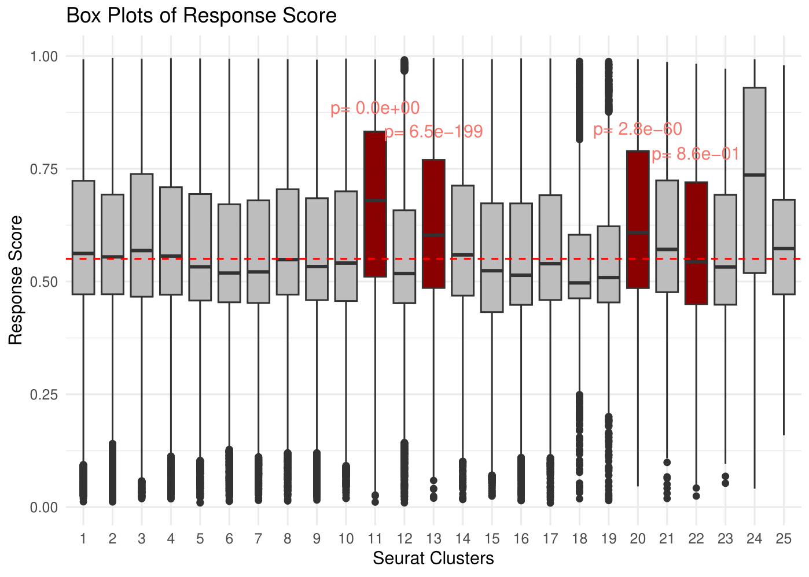
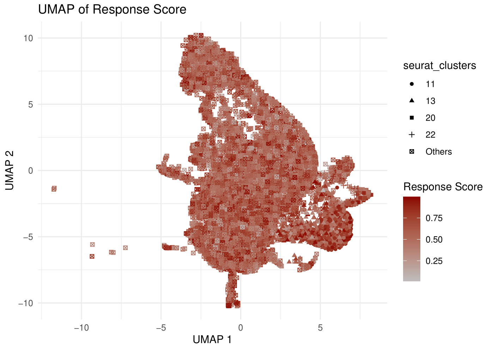
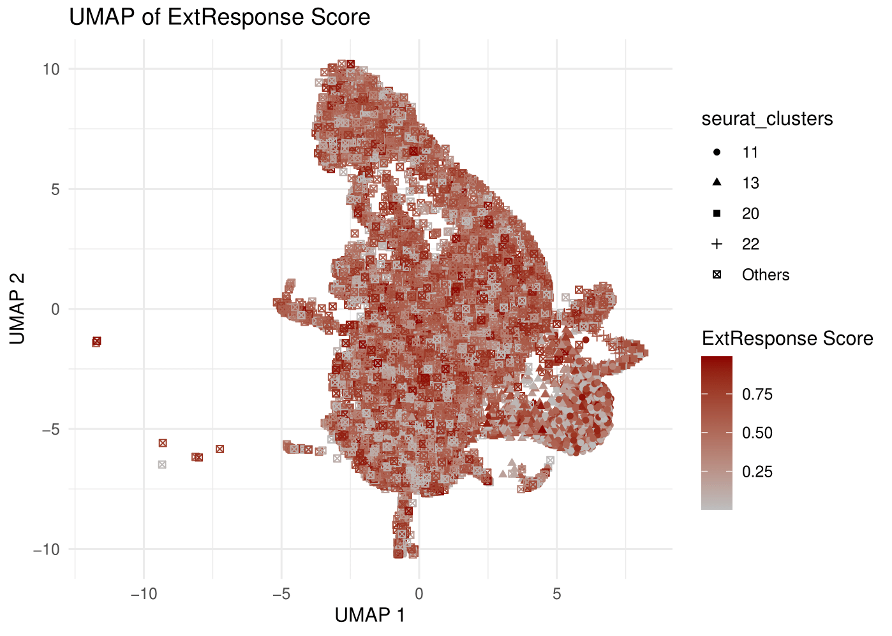
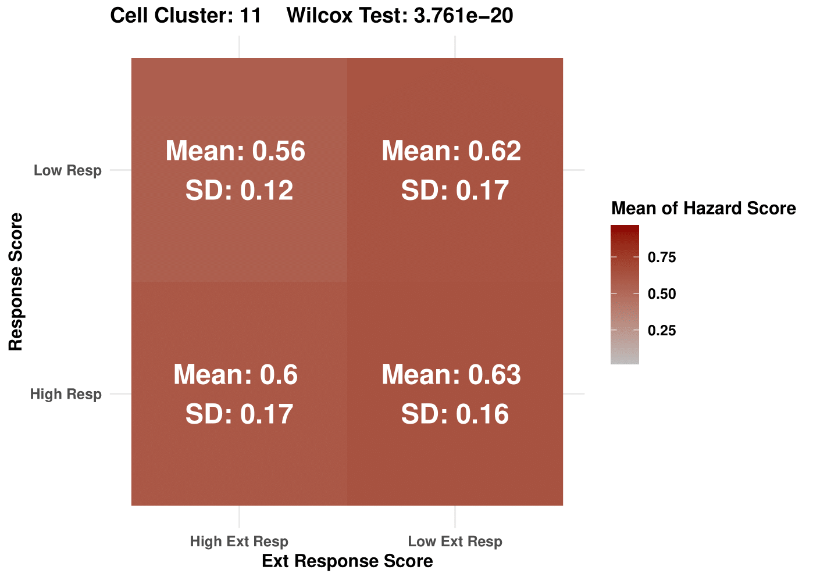
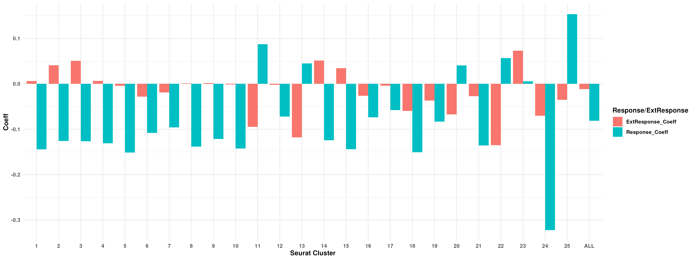

```{r}
Sys.setlocale("LC_CTYPE", "en_US.UTF-8")

library(reticulate)
library(dplyr)
library(magrittr)
library(Seurat)
library(ggplot2)
library(stringr)
library(DESeq2)
library(ggpubr)
library(DEGASv2)
library(pROC)
library(PRROC)
library(Matrix)
library(biomaRt)
library(tidyr)
#library(tidyverse)
#data_root <- "/N/u/lisih/Quartz/Downloads/MMRF"
library("Matrix")
library("Seurat")

py_install("pandas")
py_install("torch")
py_install("scipy")
py_install("tqdm")

```

Run the DEGAS model

Visualization
```{r}
visualization_MMRF <- function(folder_path, score_name) {
  results_df <- read.csv2(paste0(folder_path, "/summary_mean.csv"), sep = ",")
  meta_df <- read.csv(file = paste0("/Users/lisih/Downloads/samples_integrated_v3_2_meta.csv"))
  comb_df <- cbind(results_df, meta_df)
  # Remove duplicate columns
  comb_df <- comb_df %>%
    distinct(.keep_all = TRUE)
  comb_df$hazard <- as.numeric(comb_df$hazard)
  
  # Scatter plot 
  set.seed(42) # For reproducibility
  subsampled_data <- comb_df %>% sample_frac(0.05)
  subsampled_data <- subsampled_data %>% mutate(seurat_clusters = if_else(seurat_clusters %in% c(11, 13, 20, 22), as.character(seurat_clusters), "Others"))
  g1 <- ggplot(subsampled_data, aes(UMAP_1, UMAP_2, shape = seurat_clusters)) +                     
    geom_point(aes(color = hazard)) +
    scale_color_gradient(low = "gray", high = "darkred") + 
    theme_minimal() +
    labs(title = paste0("UMAP of ", score_name),
         x = "UMAP 1",
         y = "UMAP 2",
         color = score_name)
  ggsave(filename = paste0(folder_path, "/umap.pdf"), plot = g1) 

  
    # Box plot
    test_groups <- c(11, 13, 20, 22)
    comb_df$color <- ifelse(comb_df$seurat_clusters %in% test_groups, "darkred", "gray")
    all_groups <- comb_df$seurat_clusters %>% unique() %>% sort()
    compared_groups <- all_groups[!all_groups %in% test_groups]
    # compared_df <- comb_df %>% filter(!seurat_clusters %in% test_groups)
    
    test_red <- function(g) {
      temp_data <- comb_df %>% filter(seurat_clusters %in% c(g, compared_groups))
      temp_data$binary_label <- (temp_data$seurat_clusters == g)
      test <- wilcox.test(hazard ~ binary_label, data = temp_data)
      return(test$p.value)
    }
    mean_group <- function(g) {
      temp_data <- comb_df %>% filter(seurat_clusters %in% c(g)) 
      return(mean(temp_data$hazard))
    }
    p.values <- data.frame(seurat_clusters = test_groups, 
                           y = unlist(lapply(test_groups, mean_group)),
                           p.value = unlist(lapply(test_groups, test_red)))
    p.values$color <- "black"
    g3 <- ggplot(comb_df, aes(x = factor(seurat_clusters), y = hazard, fill = color)) +
        geom_boxplot() +
        scale_fill_identity() +
        geom_hline(yintercept = median(comb_df$hazard), linetype = "dashed", color = "red") +
        geom_text(data = p.values, aes(x = seurat_clusters, y = y + 0.2, label = paste("p=", sprintf("%.1e", p.value)), color = color), vjust = 0) +
        theme_minimal() + 
        labs(title = paste0("Box Plots of ", score_name),
             y = score_name,
             x = "Seurat Clusters") + 
        theme(legend.position = "none") # This turns off the legend
    ggsave(filename = paste0(folder_path, "/box.pdf"), plot = g3)
}
```


Run DEGAS


Response
```{r}
folder_path <- paste0("/Users/lisih/Downloads/checkpoints_MMRF_Response_Wasserstein_2024_10_30")
degas_sc_results <- run_DEGAS_SCST(paste0("/Users/lisih/Downloads/MMRF/Response.RData"), "ClassClass", "MMRF_Response", "cross_entropy", "Wasserstein", folder_path, tot_seeds = 10, tot_iters = 500, lambda1 = 3.0) 
visualization_MMRF(folder_path, "Response Score") 
```



Extended Response
```{r}
folder_path <- paste0("/N/u/lisih/Quartz/Downloads/MMRF/checkpoints_MMRF_ExtResponse_Wasserstein_2024_10_30")
degas_sc_results <- run_DEGAS_SCST(paste0("/N/u/lisih/Quartz/Downloads/run_DEGAS_from_pkg/MMRF/ExtResponse.RData"), "ClassClass", "MMRF_ExtResponse", "cross_entropy", "Wasserstein", folder_path, lambda1 = 3.0, tot_seeds = 10, tot_iters = 500) 
visualization_MMRF(folder_path, "ExtResponse Score") 
```




Survival (Progression Free Survival time) 

```{r}
folder_path <- paste0("/N/u/lisih/Quartz/Downloads/MMRF/checkpoints_MMRF_SurvPFS_ClassClass_Wasserstein_2024_10_30")
degas_sc_results <- run_DEGAS_SCST(paste0("/N/u/lisih/Quartz/Downloads/run_DEGAS_from_pkg/MMRF/SurvPFS.RData"), "ClassClass", "MMRF_SurvPFS", "cross_entropy", "Wasserstein", folder_path, tot_seeds = 10, tot_iters = 500, lambda1 = 3.0) 
visualization_MMRF(folder_path, "Progression Free Survival Hazard") 
```


visualization three dimension plot
```{r}
Survival_Hazard <- read.csv2(paste0("/N/u/lisih/Quartz/Downloads/MMRF/checkpoints_MMRF_SurvPFS_ClassClass_Wasserstein_2024_10_30/summary_mean.csv"), sep = ",")$hazard
Response_Score <- read.csv2(paste0("/N/u/lisih/Quartz/Downloads/MMRF/checkpoints_MMRF_Response_Wasserstein_2024_10_30/summary_mean.csv"), sep = ",")$hazard
ExtResponse_Score <- read.csv2(paste0("/N/u/lisih/Quartz/Downloads/MMRF/checkpoints_MMRF_ExtResponse_Wasserstein_2024_10_30/summary_mean.csv"), sep = ",")$hazard
merge_df <- data.frame(Survival_Hazard = as.numeric(Survival_Hazard), Response_Score = as.numeric(Response_Score), ExtResponse_Score = as.numeric(ExtResponse_Score))
meta_df <- read.csv(file = paste0("/N/u/lisih/Quartz/Downloads/MMRF/samples_integrated_v3_2_meta.csv"))
comb_df <- cbind(merge_df, meta_df) %>%
  distinct(.keep_all = TRUE)
```

```{r}
heatmap_hazard <- function(sc_cluster) {
    subsampled_data <- comb_df[comb_df$seurat_clusters == sc_cluster, ]
    # Split var1 and var2 into two categories each based on their medians
    subsampled_data <- subsampled_data %>%
      mutate(
        ExtResponse_Score = ifelse(ExtResponse_Score < median(ExtResponse_Score), 'Low Ext Resp', 'High Ext Resp'),
        Response_Score = ifelse(Response_Score < median(Response_Score), 'Low Resp', 'High Resp')
      )
    
    # Calculate mean of var3 for each category combination
    mean_values <- subsampled_data %>%
      group_by(ExtResponse_Score, Response_Score) %>%
      summarise(
        mean_Hazard = mean(Survival_Hazard),
        std_Hazard = sd(Survival_Hazard)
      ) %>%
      mutate(text = paste("Mean:", round(mean_Hazard, 2), "\nSD:", round(std_Hazard, 2)))
    
    
    High_Resp <- subsampled_data[subsampled_data$Response_Score == "High Resp", c("Survival_Hazard", "ExtResponse_Score")]
    w_test <- wilcox.test(High_Resp[High_Resp$ExtResponse_Score == "Low Ext Resp", "Survival_Hazard"], High_Resp[High_Resp$ExtResponse_Score == "High Ext Resp", "Survival_Hazard"])
    
    # Plot heatmap
    p <- ggplot(mean_values, aes(x = ExtResponse_Score, y = Response_Score, fill = mean_Hazard)) +
      geom_tile() +
      scale_fill_gradient(low = "gray", high = "darkred", limit = c(min(comb_df$Survival_Hazard), max(comb_df$Survival_Hazard))) +
      labs(x = "Ext Response Score", y = "Response Score", fill = "Mean of Hazard Score",
           title = paste0("Cell Cluster: ", sc_cluster, "    Wilcox Test: ", sprintf("%.3e", w_test$p.value))) +
      theme_minimal() +
      geom_text(aes(label = text), color = "white", size = 6, fontface = "bold") + 
      theme(
        text = element_text(face = "bold"), 
        plot.title = element_text(face = "bold"),
        axis.title = element_text(face = "bold"),
        axis.text = element_text(face = "bold"),
        legend.title = element_text(face = "bold"),
        legend.text = element_text(face = "bold")
      )
    ggsave(filename = paste0("/N/u/lisih/Quartz/Downloads/MMRF/checkpoints_MMRF/", sc_cluster, ".pdf"), plot = p)
}
lapply(c(11, 13, 20, 22, 24), heatmap_hazard)
```


```{r}
lm.coeff <- function(cluster) {
    lm.model <- lm(Survival_Hazard ~ Response_Score + ExtResponse_Score, data = comb_df[comb_df$seurat_clusters == cluster, ])
    coef <- data.frame(Cluster = cluster, Response_Coeff = lm.model$coefficients[2], ExtResponse_Coeff
                        = lm.model$coefficients[3])
}
coef_df <- do.call(rbind, lapply(sort(unique(comb_df$seurat_clusters)), lm.coeff))
lm.model <- lm(Survival_Hazard ~ Response_Score + ExtResponse_Score, data = comb_df)
coef <- data.frame(Cluster = "ALL", Response_Coeff = lm.model$coefficients[2], ExtResponse_Coeff
                        = lm.model$coefficients[3])
coef_df <- rbind(coef_df, coef)
```

```{r}
# Convert to long format
df_long <- pivot_longer(coef_df, cols = c(Response_Coeff, ExtResponse_Coeff), names_to = "Resp_or_ExtResp", values_to = "Coeff")
df_long$Cluster <- factor(df_long$Cluster, levels = c(seq(1, 25), "ALL"))

# Create bar plot
p <- ggplot(df_long, aes(x = Cluster, y = Coeff, fill = Resp_or_ExtResp)) +
  geom_bar(stat = "identity", position = "dodge") +
  labs(x = "Seurat Cluster", y = "Coeff", fill = "Response/ExtResponse") +
  theme_minimal() + 
  theme(
        text = element_text(face = "bold"), 
        plot.title = element_text(face = "bold"),
        axis.title = element_text(face = "bold"),
        axis.text = element_text(face = "bold"),
        legend.title = element_text(face = "bold"),
        legend.text = element_text(face = "bold")
      )
ggsave("/N/u/lisih/Quartz/Downloads/MMRF/checkpoints_MMRF/coeff.png", plot = p, width = 16, height = 6, dpi = 300)

```

